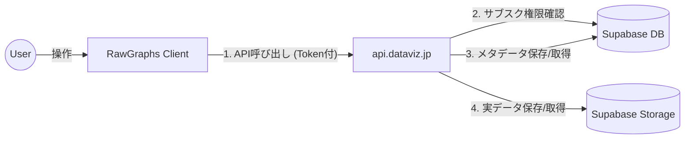

# RawGraphs クラウド保存機能 実装計画

## 1. 概要
RawGraphs ツールで作成したプロジェクトファイル（`.rawgraphs` 形式の JSON データ）を、クラウド上に保存・読み込み可能にする機能です。
ユーザーはローカルファイル管理の手間から解放され、ブラウザを変えても同じ作業環境にアクセスできるようになります。
本機能は、**有効なサブスクリプションを保持するログインユーザー**のみが利用可能です。

## 2. アーキテクチャ構成

**基本方針**:
- ファイルの実体（データ容量が大きい）は **Supabase Storage** に保存。
- ファイルの所有権やメタデータ（名前、作成日など）は **Supabase Database** で管理。
- フロントエンドからの直接アクセスは避け、**api.dataviz.jp (Backend API)** を経由することで、厳密な権限チェック（サブスクリプション状態）とログ管理を行う。



---

## 3. データ設計

### A. Supabase Storage (ファイル実体)
- **バケット名**: `user_projects` (Private Bucket)
- **ファイルパス規則**: `{user_id}/{project_uuid}.json`
- **内容**: `.rawgraphs` ファイルと同等の JSON データ（データセット、マッピング設定、チャート設定を含む）。

### B. Supabase Database (管理情報)
全ツール共通の `projects` テーブルを作成し、レコードとして管理します。
ツールごとのデータは `app_name` カラムで識別します。

**テーブル名**: `projects` (新規作成)

| カラム名 | 型 | 説明 |
| :--- | :--- | :--- |
| `id` | `uuid` | PK. デフォルト `gen_random_uuid()` |
| `user_id` | `uuid` | FK to `auth.users`. 所有者 |
| `name` | `text` | ユーザーが付けたプロジェクト名 |
| `storage_path` | `text` | Storage 内のパス (例: `abcd-1234.../xyz-789.json`) |
| `app_name` | `text` | ツール識別子 (例: `'rawgraphs'`, `'svg-textures'`) |
| `created_at` | `timestamptz` | 作成日時 |
| `updated_at` | `timestamptz` | 更新日時 |

---

## 4. API 設計 (api.dataviz.jp)

全ての API 呼び出しにおいて、`Authorization: Bearer {token}` ヘッダーを必須とし、**サブスクリプションが active / trialing であること** を検証します。

### エンドポイント一覧

#### 1. プロジェクト一覧取得
- **Method**: `GET`
- **Path**: `/api/projects?app=rawgraphs`
- **Query Param**: `app` (必須) - 取得したいツールの識別子を指定。
- **処理**:
  ```sql
  SELECT * FROM projects
  WHERE user_id = auth.uid()
  AND app_name = 'rawgraphs'
  ORDER BY updated_at DESC;
  ```
  上記クエリに相当するデータを返す。実データは返さない。

#### 2. プロジェクト新規保存
- **Method**: `POST`
- **Path**: `/api/projects`
- **Body**:
  ```json
  {
    "name": "売上分析2025",
    "app_name": "rawgraphs",
    "data": { ...rawgraphs_json_content... }
  }
  ```
- **処理**:
  1. ランダムな UUID を生成。
  2. Supabase Storage へ JSON データをアップロード（パス: `{user_id}/{uuid}.json`）。
  3. 成功後、Supabase DB の `projects` テーブルへレコードを INSERT。
- **Response**: 作成されたプロジェクト情報の概要。

#### 3. プロジェクト読み込み（実データ取得）
- **Method**: `GET`
- **Path**: `/api/projects/:id`
- **処理**:
  1. DB の `projects` テーブルから、`id` が一致かつ `user_id` が自身のレコードを検索（所有権確認）。
  2. レコード内の `storage_path` を使って Storage から JSON ファイルをダウンロード。
  3. クライアントへ JSON をそのまま返す。

#### 4. プロジェクト削除
- **Method**: `DELETE`
- **Path**: `/api/projects/:id`
- **処理**:
  1. DB の `projects` テーブルから対象レコードを取得・削除。
  2. 削除できた場合、Storage から対応するファイルを削除。


---

## 5. バックエンド実装詳細 (For dataviz-api / Supabase)

作業引き継ぎ用の技術詳細です。

### 1. データベース定義 (SQL)

```sql
-- 1. Projects Table
create table public.projects (
  id uuid default gen_random_uuid() primary key,
  user_id uuid references auth.users(id) on delete cascade not null,
  name text not null,
  storage_path text not null,
  app_name text not null, -- 'rawgraphs', 'svg-textures', etc.
  created_at timestamptz default now(),
  updated_at timestamptz default now()
);

-- Index for faster queries
create index projects_user_id_app_name_idx on public.projects (user_id, app_name);

-- 2. RLS Policies (Deep Defense)
-- APIがService Roleでアクセスする場合はバイパスされますが、
-- 将来的な直接アクセスやコンソール操作の安全のために設定推奨。
alter table public.projects enable row level security;

create policy "Users can view own projects"
  on public.projects for select
  using ( auth.uid() = user_id );

create policy "Users can insert own projects"
  on public.projects for insert
  with check ( auth.uid() = user_id );

create policy "Users can update own projects"
  on public.projects for update
  using ( auth.uid() = user_id );

create policy "Users can delete own projects"
  on public.projects for delete
  using ( auth.uid() = user_id );
```

### 2. Storage 設定

*   **Bucket Name**: `user_projects`
*   **Public Access**: `False` (Private)
*   **File Size Limit**: `10MB` (RawGraphsのJSONは数MBになる可能性があるため)
*   **Allowed MIME Types**: `application/json`

### 3. API ロジック詳細

#### サブスクリプションチェック (必須)
全てのエンドポイントで、処理実行前に以下のチェックを行ってください。

```javascript
// 擬似コード
const { data: subscription } = await supabase
  .from('subscriptions')
  .select('status')
  .eq('user_id', userId)
  .in('status', ['active', 'trialing'])
  .single();

if (!subscription) {
  return res.status(403).json({ error: 'Subscription required' });
}
```

#### CORS 設定
RawGraphs ツールからのアクセスを許可する必要があります。
*   Allowed Origins: `https://raw.dataviz.jp`, `http://localhost:3000` (開発用)

#### エラーハンドリング
*   `401 Unauthorized`: トークンなし、無効
*   `403 Forbidden`: サブスクリプション切れ、他人のリソースへのアクセス
*   `404 Not Found`: 指定IDのプロジェクトが存在しない

---

## 6. フロントエンド実装ステップ (RawGraphs)
(以下、元の記述通り)

### Step 1: UI 実装（仮組み）
API 通信を行わない状態で、UI コンポーネントのみを配置します。

1. **保存 UI「クラウドに保存」**
   - 場所: 「5. 書き出す」セクション (Exporter.js周辺)
   - 動作: クリックでモーダル表示 → 名前入力 → 保存ボタン（ここでの保存はまだ console.log 等で代用）。
   - 制御: 未ログイン/サブスク未加入時はボタンを非活性化 or アップグレード訴求を表示。

2. **読み込み UI「クラウドから開く」**
   - 場所: 「1. データを読み込む」セクション (DataLoader.js周辺)
   - 動作: 新しいタブまたはボタンを追加。クリックでプロジェクト一覧（仮データ）を表示。

### Step 2: API 連携実装
`src/utils/api.js` 等のヘルパーを作成し、`api.dataviz.jp` との通信処理を実装します。

1. **認証トークン利用**
   - `window.supabase.auth.session()` から Access Token を取得し、全ての Fetch リクエストの Header に付与する仕組みを作る。

2. **保存処理の実装**
   - 現在の `exportProject` 関数で生成される JSON オブジェクトを、API に POST する処理を実装。

3. **読み込み処理の実装**
   - 一覧 API を叩きリスト表示。
   - 選択されたプロジェクト ID で詳細 API を叩き、返ってきた JSON を `hydrateFromSavedProject` 関数（既存機能）に渡して復元。

---

## 7. セキュリティと権限管理

- **認証**: `dataviz-auth-client.js` が管理する Supabase セッションを利用。
- **認可**: バックエンド API 側で、リクエストごとに「ユーザーのサブスクリプションステータス」を必ずチェックする。期限切れや解約済みのユーザーは保存・読み込みができないようにする（読み込みだけ許可するかは要検討だが、基本はフル機能制限でよい）。
- **データ分離**: Supabase Storage / DB ともに `user_id` をキーとし、他人のデータには物理的にアクセスできない構造とする（RLSポリシーも併用推奨）。
